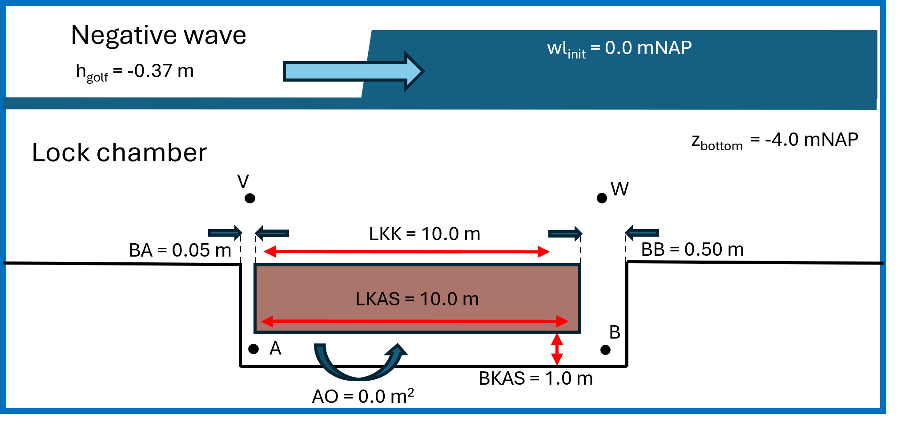

.. |br| raw:: html

    

.. _example:

Example: Simple lock with schematized wave
===========
This example demonstrates the capability of the KASGOLF code by applying it to an hypothetical scenario. An overview of the lock and lockgate can be found in the figure below. The simulation starts at time t=-6.0 [s] with a time step of 0.02 [s]. A negative wave with height h=-0.37 [m] arrives at location V at time t=0 [s] and propagates to location W with the velocity of the ship (M0=1 and VS=1.4 [m/s]). It is assumed that there is no horizontal opening underneath the gate (AO=0 [:math:`m^2`]) and the friction coefficient (:math:`\mu`) for the discharge through the vertical and horizontal openings between the lock chamber and gate recess is equal to 0.70 [-]. 

The result of schematizing the example lock will be generated by the code and shown in one figure. This figure shows the hydraulic head over the lockgate throughout time. Negative head is directed to the lock chamber and positive head is directed towards the gate recess. The output png figure is stored in the same directory and with the same name as the input file. The output figure of the previously schematized example is shown in the figure below:

.. image:: ../images/example_uitvoer_code.png

In the figure above, it can be seen that the head is increasingly negative, thus increasing the force on the lockgate towards the lock chamber, in the first 7 seconds. This is caused by a delay of the waterlevel in the gate recess with respect to the waterlevel in the lock chamber. The velocity of the negative translatory wave in the gate recess exceeds that in the lock chamber, though, the waveheight is significantly smaller due to the relatively small channels leading to increasing negative head. After 7 seconds, the wave in the lock chamber arrives at the wider channel at location W. This generates a second negative wave in the gate recess, due to which the average waterlevel in the gate recess drops below that in the lock chamber. As a result, positive head pushes the lockgate towards the lock chamber. Afterwards, the wave height of the translatory wave dampens as well as the head over the gate. 

.. note::

   Additionally it can be seen that an instability occurs in the calculated hydraulic head. This is a numerical instability in the code caused by iterations of the discharge and water height of the translatory wave in the gate recess. See `sensitivity analysis <https://lockgate5-branch2.readthedocs.io/en/latest/example.html>`_ for a further analysis on this numerical instability.

##################

The input file that was used for the calculation of this example case is shown below.

.. image:: ../input/Example_invoer.IN  
