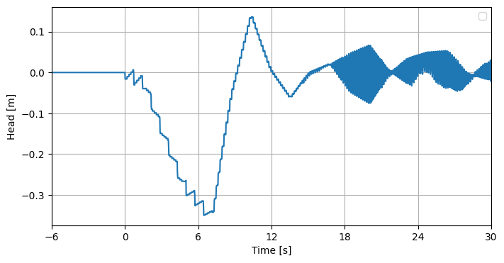

.. _installatie:

Getting getting-started
===========

.. note::

   Caution! Currently, the translation of the Fortran code of KASGOLF to Python code is still under construction. That means that the code of KASGOLF is not yet ready to be openly published. This read the docs is written as if the code has been finalised and published by Deltares. The actual completion of this process is planned for the future.

##################

Requirements
--------------------------
Typical end-users will use the function :py:func:`runKasgolf` to run a KASGOLF simulation. Few additional Python libraries are required to run this code. You can install the required libraries with the following command:

.. code-block:: console

   pip3 install ./docs/requirements.txt

Running a simulation
--------------------------
When running :py:func:`runKasgolf` one output figure will be generated. This figure shows the head difference over the gate throughout time. An example of the output figure is shown below:

