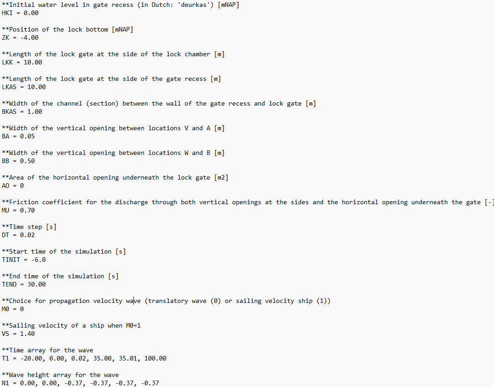

.. _installatie:

Getting started
===========

.. note::

   Caution! Currently, the translation of the Fortran code of KASGOLF to Python code is still under construction. That means that the code of KASGOLF is not yet ready to be openly published. This read the docs is written as if the code has been finalised and published by Deltares. The actual completion of this process is planned for the future.

##################

Requirements
--------------------------
Typical end-users will use the function :py:func:`runKasgolf` to run a KASGOLF simulation. Few additional Python libraries are required to run this code. You can install the required libraries with the following command:

.. code-block:: console

   pip3 install ./docs/requirements.txt

Running a simulation
--------------------------
Upon running a simulation with :py:func:`runKasgolf` a file explorer window will be opened that allows you to select one input file (``.in``) that is required for the simulation which describes the lock and gate characteristics. The input file already includes the decision for the method that is used to calculate the propagation velocity of the wave in the lock chamber (translatory wave (M0=0) or using the velocity of a passing ship (M0=1)). The KASGOLF code generates an output png figure which is stored in the same directory and with the same name of the input file in which '.in' is replaced by '.png'. An overview of the input file is provided in the figure below. 

