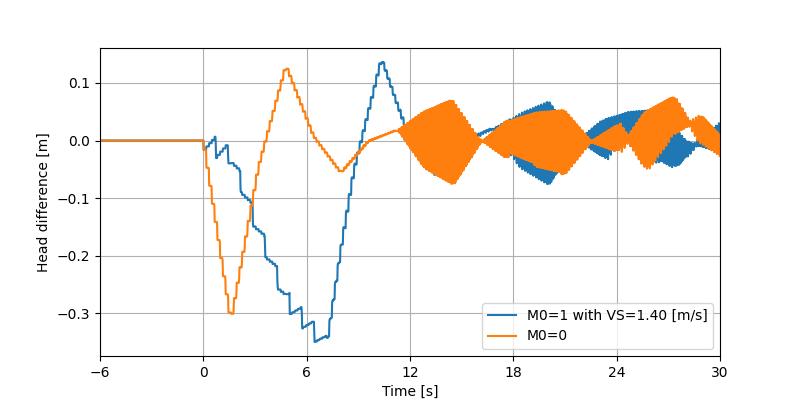
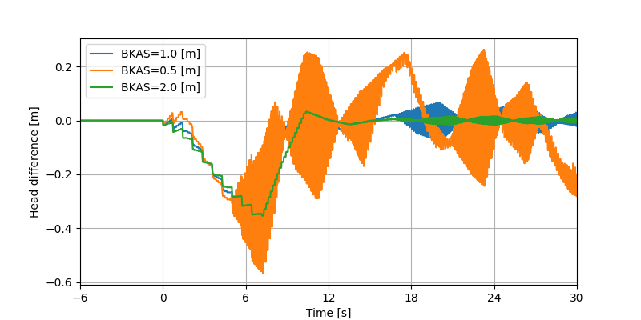
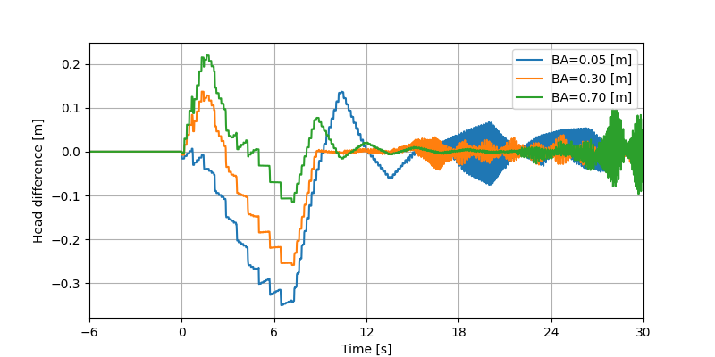
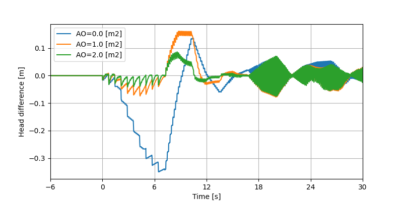
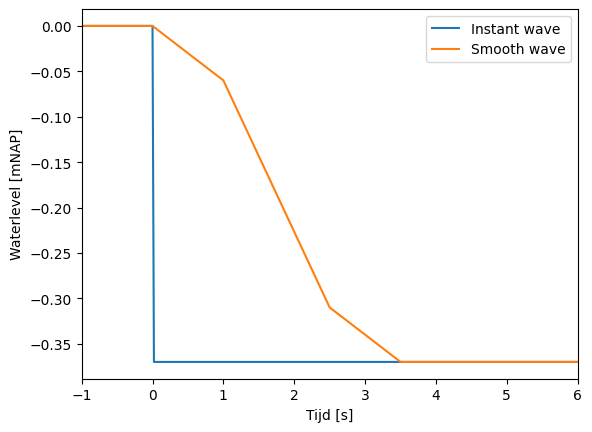
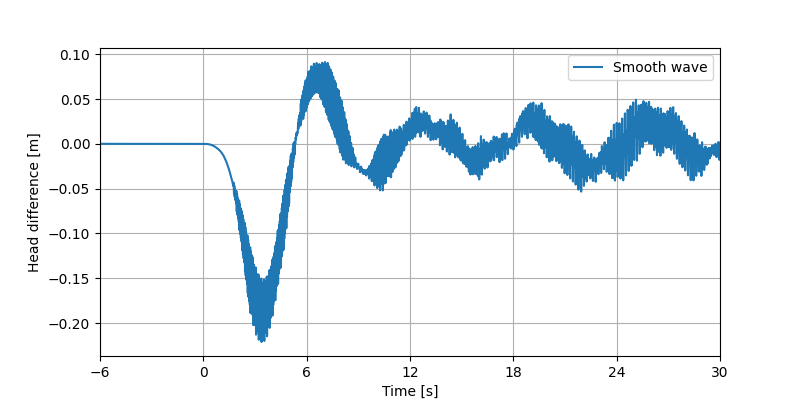

Sensitivity Analysis
===========

The use of sailing velocity (M0=1)
--------------------------------
As mentioned in `getting started <https://lockgate5-branch2.readthedocs.io/en/latest/theory.html>`_, the user can choose to define the wave propagation velocity in the lock chamber through the sailing velocity of a ship. Note that this needs to have a higher value than is calculated by linear wave theory, otherwise the code will raise an error. As a result, the wave in the lock chamber propagates with an equal or higher velocity than the translatory wave in the gate recess. In the example below a sailing velocity of 10.0 m/s is used (translatory wave propagation velocity = +/- 6.27 [m/s]).

As can be seen in the figure, higher propagation velocity in the lock chamber causes larger head difference that occurs earlier than if this equals the propagation velocity in the gate recess (translatory wave). The numerical instability occurs at roughly the same time step.

Spacing between gate and gate recess wall
--------------------------------

A space is present between the gate and gate recess wall, refered to as 'channel'. The width of this channel is varied and the result is shown in the figure below.

As the figure shows, reducing the width of the channel also reduces the peak in head difference of the gate. Namely, a smaller channel results in a larger waveheight of the translatory wave. At the same time it can be seen that the influence of numerical instability increases. This reduces for a wider channel, because the waveheight of the translatory wave is less sensitive.

Width of the vertical opening 
--------------------------------

Two vertical openings are present on the sides of the gate which can differ in spacing. In the figure below, the spacing of the vertical opening at location A (BA, first that is reached by the incoming wave) is altered.

From the figure it can be seen that the head difference is highly sensitive to the width of the opening at A (BA). A wider channel results in faster response of the waterlevel in the channel, reducing the head difference. For the simulation in which BA exceeds the width of the opening at B (BB=0.50 [m], green line), the maximum positive head difference is larger than for the simulation where BA=0.30 [m] (orange line). However, for a very small spacing at opening 1 (BA), the positive and negative head difference are largerst. Numerical instability seems to occur later in the simulation when increasing BA.

Horizontal opening underneath the gate
--------------------------------

Next to vertical openings on the sides of the gate, also a horizontal opening can be present underneath the gate. This variable is given as the area of this opening in [m] (AO). In previous runs, no horizontal opening was present. In the figure below this opening is implement with varying area.

As can be seen in the figure, response in head difference is somewhat different when a horizontal gap is present. This is related to the response of the waterlevel in the gate recess. Additionally, an opening underneatht the gate lowers the extremes in head difference, which is strongest for the negative. Numerical instability seems to occur at the same time into the simulation.

Different wave shape
--------------------------------

In previous examples, a wave is used that is described as an instant change in waterlevel (within 1 timestep). In reality the wave has a smoother profile. The figure below shows the change in shape of the wave, note that the time span on the x-axis is altered compared to other figures. The second figure shows the head difference as calculated with this smoother wave (for result of the steep wave, see the blue line in the first figure).

As can be seen in the second figure above, the head difference output graph shows a smoother response. Also the extremes are lowered. Instability seems to occur earlier in the simulation.