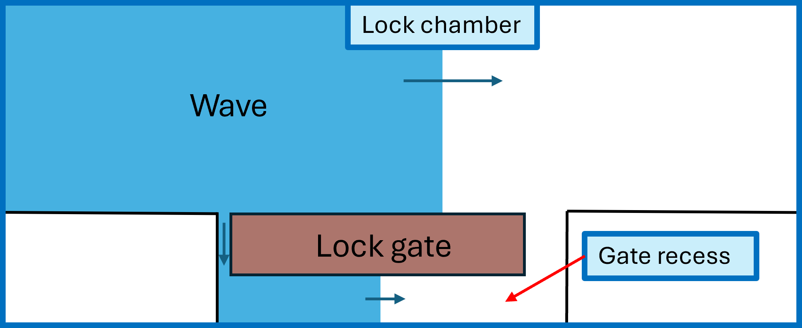

.. |br| raw:: html

    

.. _theory:

Theory
===========

.. note::

   Caution! Currently, the translation of the Fortran code of KASGOLF to Python code is still under construction. That means that the code of KASGOLF is not yet ready to be openly published. This read the docs is written as if the code has been finalised and published by Deltares. The actual completion of this process is planned for the future.

##################

KASGOLF can be used to calculate head difference over an opened lockgate. The head difference is driven by a passing wave generated by a ship that sails in or out of the lock. Through vertical openings on the sides of the gate and a horinzontal opening underneath the gate, water flows between the lock chamber and gate recess ('deurkas' in Dutch). As a result, a translatory wave will propagate through the lock recess affecting the head difference over the gate.

To run a simulation with KASGOLF, the water depth of the lock and the dimensions of the gate, gate recess and openings need to be inserted in the model. The wave height can be inserted as a time array. For the wave propagation velocity in the lock chamber the user of the model can choose between the propagation velocity of the translatory wave or the sailing velocity of the ship. The propagation velocity of the translatory wave is based on linear wave theory. When chosen for the second option, the wave propagation velocity for the lock chamber can differ for that in the gate recess.

 that has vertical openings on both sides of the gate as well as an horizontal opening underneath the gate

