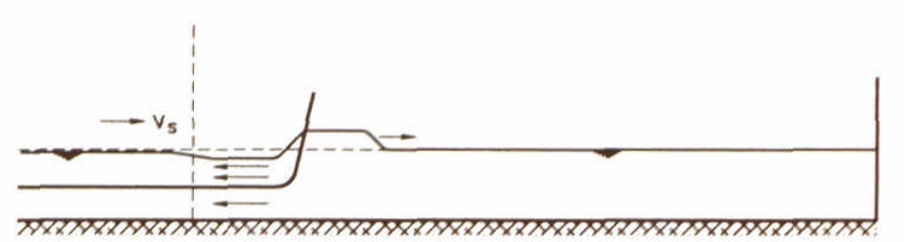
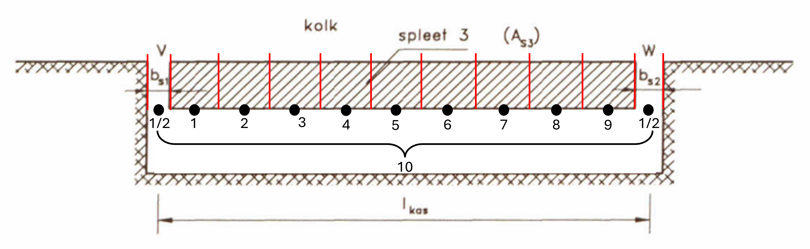

Theory
===========

KASGOLF can be used to calculate the head difference over an opened lockgate when a water level variation passes the gate. The head difference is the difference in water level between both sides of the lockgate (in the lock chamber and in the gate recess). This head difference is driven by a passing ship that sails in or out of the lock creating various water level variations. Literature [3] provides that for a ship sailing into the lock, a bow wave with certain height is pushed into the lock and forms a translatory wave with the propagation velocity as calculated with shallow wave theory. The movement of the ship forms a backflow and as a result the water level alongside the ship drops, see the figure below. For a ship that sails out of the lock only the latter water level variation occurs in the lock chamber. Further theory on the occurance of water level variation around a ship sailing in or out of a lock can be found in [3]. 

Through vertical openings on the sides of the gate and a horinzontal opening underneath the gate, water flows between the lock chamber and gate recess ('deurkas' in Dutch). These flows are calculated using the energy conservation law in open channel flow. As a result, a translatory wave will propagate through the gate recess affecting the head difference over the gate. The gate is considered as an infinitely thin plate, since processes within the vertical openings have minimal influence on the characteristics of the translatory wave in the gate recess and therefore can be neglected. A top view of an opened lock with propagating wave is shown in the figure below:

.. image:: ../images/overzicht_kas_kolk.png

For the calculation of these water levels, the length of the gate is divided in 10 equal sections (both channels are half and together count as 1, see the figure below) with each section having a water level on both sides of the lockgate. By averaging the water levels in the sections, the average water level on both sides of the gate is calculated and is translated into the head difference over the gate. Friction on the translatory wave in the gate recess is neglected in KASGOLF.

To run a simulation with KASGOLF, the bed level of the lock and the dimensions of the gate, gate recess and openings need to be inserted in the model. The wave height of the water level variation in the lock chamber is inserted as a time array for location A. After a certain delay, this wave height then reaches location B. For the propagation velocity of this wave in the lock chamber the user of the model can choose between two options: 1) the propagation velocity of the translatory wave or the sailing velocity of the ship. The propagation velocity of the translatory wave (wave celerity) in the gate recess is calculated using shallow wave theory:

.. math::

   c = \sqrt{g \cdot h}

where:

- c \ is the wave celerity \([m/s]\),
- g \ is the gravitational acceleration \([m/s^2]\),
- h \ is the water depth \([m]\).

